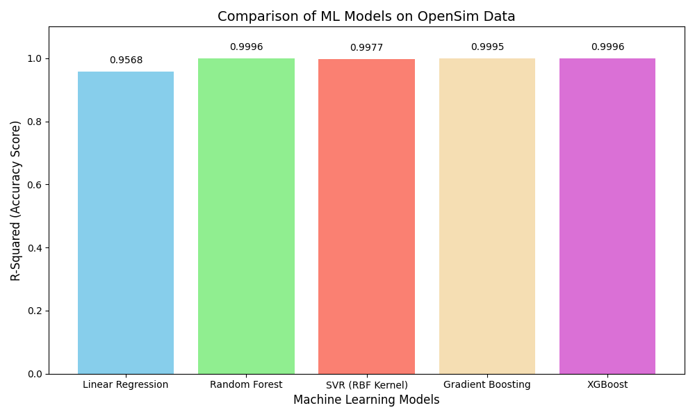

# Data Generation using Modelling and Simulation for Machine Learning

##  Assignment Overview
This project demonstrates **data generation using modelling and simulation** and subsequent **machine learning model comparison**, as required in the assignment *“Data Generation using Modelling and Simulation for Machine Learning”*.

The workflow includes:
- Selecting a simulation tool
- Generating synthetic data using simulation
- Running 1000 simulations
- Training and comparing multiple ML models
- Reporting results using tables and graphs

---

##  Step 1: Simulation Tool Selection
**Simulation Tool Used:** OpenSim  
**Reason for Selection:**
- Open-source biomechanical simulation framework
- Supports physics-based modeling
- Widely used in research and academia

Reference:  
https://en.wikipedia.org/wiki/List_of_computer_simulation_software

---

##  Step 2: Simulator Installation & Exploration
OpenSim was installed and explored using its Python API.  
A **simple pendulum system** was modeled to understand parameter behavior and simulation outputs.

---

##  Step 3: Parameter Identification and Bounds
The following parameters were identified and varied:

| Parameter | Description | Lower Bound | Upper Bound |
|---------|-------------|------------|------------|
| Mass | Mass of pendulum body | 0.5 | 5.0 |
| Initial Speed | Angular speed at start | -10.0 | 10.0 |

---

##  Step 4 & Step 5: Data Generation using Simulation
- A pendulum model was simulated using OpenSim
- Random values of **mass** and **initial speed** were generated
- **1000 simulations** were executed
- The **final angular position** after 1 second was recorded

### Generated Dataset
Each simulation produced one record with:

| Feature | Description |
|-------|------------|
| mass | Random pendulum mass |
| initial_speed | Initial angular speed |
| final_position | Output from simulation (target variable) |

##  Step 6: Machine Learning Model Comparison

### Models Evaluated
Five regression models were trained and evaluated:

- Linear Regression
- Random Forest Regressor
- Support Vector Regressor (RBF Kernel)
- Gradient Boosting Regressor
- XGBoost Regressor

---

##  Evaluation Metrics
Models were compared using the following metrics:

| Metric | Description |
|------|-------------|
| MAE | Mean Absolute Error |
| RMSE | Root Mean Squared Error |
| R² Score | Accuracy measure |

---

##  Results Table

| Model | R² Score |
|------|----------|
| Linear Regression | 0.9568 |
| Random Forest | 0.9996 |
| SVR (RBF Kernel) | 0.9977 |
| Gradient Boosting | 0.9995 |
| XGBoost | 0.9996 |

---

##  Best Model
**Random Forest Regressor** and **XGBoost** achieved the highest R² scores.

**Selected Best Model:**  
✅ **Random Forest Regressor**

**Reason:**
- High prediction accuracy
- Stable performance
- Lower complexity compared to XGBoost

---

##  Result Visualization

The following graph compares the R² scores of all evaluated models:

---

## 🧠 Conclusion
This project successfully demonstrates how **simulation-generated data** can be used for **machine learning model training and evaluation**.  
The results show that ensemble models such as **Random Forest** and **XGBoost** perform exceptionally well on physics-based synthetic datasets.

---

## 👩‍💻 Author
**Sukhmanpreet Kaur**  

